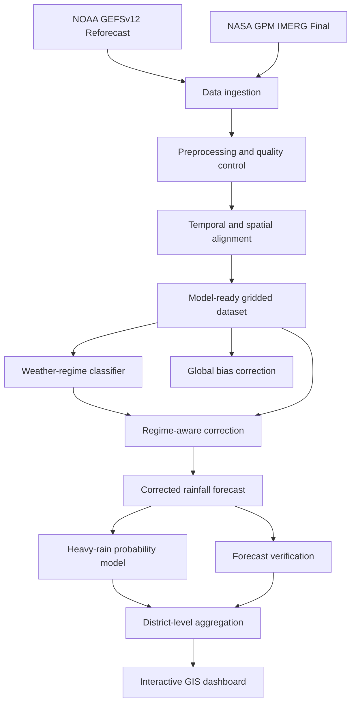
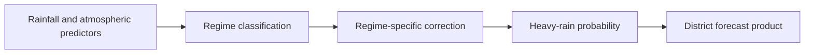

# 🌧️ Regime-Aware AI Post-Processing of Monsoon Rainfall Forecasts

An AI/ML-based research prototype that identifies Indian monsoon weather regimes and applies regime-specific correction to raw Numerical Weather Prediction rainfall forecasts.

The system generates:

- Weather-regime classifications
- Bias-corrected rainfall forecasts
- Heavy and very-heavy rainfall probabilities
- District-level rainfall products
- Forecast verification reports
- An interactive GIS dashboard

> ⚠️ **Research prototype:** This system currently uses July 2018 data and must not be interpreted as an official weather-warning system.

---

## 📌 Problem Statement

Rainfall forecast errors over India vary according to prevailing weather regimes, including:

- Active monsoon
- Break monsoon
- Monsoon lows and depressions
- Coastal rainfall
- Orographic rainfall
- Western disturbances

A single global bias-correction method may not work equally well for all weather conditions.

This project investigates whether an AI/ML system can:

1. Identify the prevailing monsoon weather regime.
2. Apply a correction suitable for that regime.
3. Improve raw NWP rainfall forecasts.
4. Estimate heavy-rainfall probabilities.
5. Generate district-level rainfall products.
6. Communicate the results through an interactive GIS dashboard.

---

## 🎯 Project Objectives

- Process GEFSv12 rainfall forecasts over India.
- Align GEFS forecasts with NASA GPM IMERG observations.
- Extract atmospheric predictors associated with monsoon circulation.
- Identify active, break, normal and low/depression regimes.
- Compare raw, global-corrected and regime-corrected rainfall.
- Estimate the probability of operational rainfall thresholds being exceeded.
- Verify forecasts using deterministic, categorical, spatial and probabilistic metrics.
- Produce district-level rainfall maps and tables.
- Present the results through a deployable Streamlit dashboard.

---

# 🔄 End-to-End Workflow



---

## 🧠 AI and Forecasting Workflow



### Inputs

The model uses:

- Raw GEFS rainfall forecast
- Mean sea-level pressure
- 850 hPa zonal wind
- 850 hPa meridional wind
- 850 hPa specific humidity
- Derived 850 hPa wind speed
- Latitude and longitude
- Forecast date and seasonal information

### Outputs

The pipeline generates:

- Predicted weather regime
- Raw GEFS rainfall
- Globally corrected rainfall
- Regime-corrected rainfall
- Heavy-rain probability
- Very-heavy-rain probability
- District-level rainfall statistics
- Experimental district risk category

---

# 📊 Data Sources

## 1. NOAA GEFSv12 Reforecast

GEFSv12 reforecast data is used for rainfall forecasts and atmospheric predictors.

Variables used:

| Variable | Description |
|---|---|
| APCP | Accumulated precipitation |
| PRES | Mean sea-level pressure |
| UGRD | 850 hPa zonal wind |
| VGRD | 850 hPa meridional wind |
| SPFH | 850 hPa specific humidity |
| Wind speed | Derived from UGRD and VGRD |

Forecast configuration:

- Control member: `c00`
- Rainfall window: approximately +24 to +48 hours
- Atmospheric predictors: approximately +36-hour forecast
- Prototype period: July 2018
- Domain: Indian region

Source: [NOAA GEFS Reforecast Registry](https://registry.opendata.aws/noaa-gefs-reforecast/)

---

## 2. NASA GPM IMERG Final V07

NASA GPM IMERG Final daily precipitation is used as the reference rainfall observation.

IMERG rainfall is:

- Cropped to the Indian region
- Converted to compatible units
- Reoriented when necessary
- Interpolated onto the GEFS grid
- Matched with the corresponding forecast-valid date

Source: [NASA GPM IMERG Final Daily V07](https://disc.gsfc.nasa.gov/datasets/GPM_3IMERGDF_07/summary)

---

## 3. Indian Administrative Boundaries

District boundaries are used to convert gridded rainfall forecasts into district-level products.

Source: [geoBoundaries API](https://www.geoboundaries.org/api.html)

The dashboard uses a simplified boundary file to reduce deployment size and improve map-loading speed.

---

# 🧪 Methodology

## 1. Rainfall preparation

The rainfall-processing pipeline:

1. Reads GEFS GRIB2 precipitation.
2. Selects the required forecast steps.
3. Calculates the rainfall accumulated during the target forecast window.
4. Crops the forecast to the Indian domain.
5. Reads the corresponding IMERG daily observation.
6. Interpolates IMERG rainfall onto the GEFS grid.
7. Saves paired forecast and observation products.

The resulting July dataset contains:

```text
Dates:       31
Latitudes:   129
Longitudes:  121
Resolution:  0.25 degrees
```

---

## 2. Atmospheric predictor preparation

Atmospheric predictors are extracted at approximately forecast hour +36.

The following variables are used:

- Mean sea-level pressure
- 850 hPa zonal wind
- 850 hPa meridional wind
- 850 hPa specific humidity
- Derived 850 hPa wind speed

These predictors describe the large-scale circulation and moisture conditions associated with different monsoon regimes.

---

## 3. Weather-regime classification

The current prototype defines four regimes:

| Regime | Prototype days |
|---|---:|
| Active | 4 |
| Break | 9 |
| Low/Depression | 7 |
| Normal | 11 |

A Random Forest classifier predicts the weather regime from atmospheric and rainfall features.

### Classifier results

| Metric | Result |
|---|---:|
| Accuracy | 0.5484 |
| Balanced accuracy | 0.6089 |
| Macro F1 | 0.5826 |

These results are preliminary because the classifier is trained using only 31 dates.

---

## 4. Rainfall correction

The project compares three rainfall products:

1. Raw GEFS rainfall
2. Global bias-corrected rainfall
3. Regime-aware bias-corrected rainfall

The current regime-aware model applies correction parameters learned separately for each predicted regime.

Four-fold out-of-fold evaluation is used to prevent the same dates from being directly used for both model fitting and evaluation.

---

## 5. Heavy-rain probability

Probabilistic models estimate the chance that rainfall will exceed operational thresholds.

| Event | Threshold |
|---|---:|
| Heavy rainfall | ≥ 64.5 mm/day |
| Very heavy rainfall | ≥ 115.6 mm/day |
| Extremely heavy rainfall | ≥ 204.5 mm/day |

The prototype currently publishes heavy and very-heavy rainfall probabilities.

---

## 6. District-level aggregation

Each model grid point is mapped to an Indian district.

Current mapping summary:

| Item | Count |
|---|---:|
| Rectangular grid points | 15,609 |
| Grid points inside India | 4,652 |
| Total district geometries | 735 |
| Districts containing a grid centre | 707 |
| Districts using nearest-grid fallback | 28 |

District output includes:

- Mean raw GEFS rainfall
- Maximum raw GEFS rainfall
- Mean corrected rainfall
- Maximum corrected rainfall
- Mean observed rainfall
- Maximum observed rainfall
- Maximum heavy-rain probability
- Maximum very-heavy-rain probability
- Experimental risk category

---

# 📏 Verification Metrics

## Deterministic metrics

- Root Mean Square Error — RMSE
- Mean Absolute Error — MAE
- Mean Bias
- Spatial correlation

## Categorical metrics

- Critical Success Index — CSI
- Probability of Detection — POD
- False Alarm Ratio — FAR
- Equitable Threat Score — ETS

## Spatial metric

- Fractions Skill Score — FSS

## Probabilistic metrics

- Brier Score
- Brier Skill Score
- ROC-AUC
- PR-AUC

---

# 📈 Prototype Results

## Overall four-fold out-of-fold rainfall evaluation

| Product | RMSE | MAE | Bias | Correlation |
|---|---:|---:|---:|---:|
| Raw GEFS | 20.3831 | 10.9803 | 5.3367 | 0.4282 |
| Global correction | 19.2933 | 9.3261 | 1.7955 | 0.4183 |
| Regime-aware correction | **19.2833** | **9.3194** | **1.7754** | 0.4181 |

Compared with raw GEFS, the regime-aware prototype produces approximately:

- **5.4% lower RMSE**
- **15.1% lower MAE**
- **66.7% lower absolute mean bias**

However, the improvement over global correction is very small. A larger multi-season dataset is required to determine whether this advantage generalizes.

---

## Regime-wise evaluation

| Regime | Model | RMSE | MAE | Bias |
|---|---|---:|---:|---:|
| Active | Raw GEFS | 21.8238 | 11.6264 | 5.0802 |
| Active | Regime-aware | 20.8625 | 10.1098 | 1.6631 |
| Break | Raw GEFS | 18.4038 | 10.1934 | 5.4589 |
| Break | Regime-aware | 17.2229 | 8.4030 | 1.9441 |
| Low/Depression | Raw GEFS | 23.7148 | 12.4247 | 6.0588 |
| Low/Depression | Regime-aware | 22.5074 | 10.6809 | 2.0885 |
| Normal | Raw GEFS | 19.0441 | 10.4700 | 4.8704 |
| Normal | Regime-aware | 18.0164 | 8.9154 | 1.4788 |

---

## Heavy-rain probability evaluation

| Event | ROC-AUC | PR-AUC | CSI | POD | FAR | ETS |
|---|---:|---:|---:|---:|---:|---:|
| Heavy rainfall | 0.9099 | 0.1168 | 0.0945 | 0.2074 | 0.8521 | 0.0858 |
| Very heavy rainfall | 0.9213 | 0.0304 | 0.0306 | 0.0828 | 0.9537 | 0.0294 |

Although ROC-AUC is high, the lower PR-AUC, CSI and POD values show that rare-event forecasting remains difficult.

The high FAR indicates that the probability model currently produces too many false alarms. Therefore, the probability outputs are experimental and should not be interpreted as warnings.

---

# 🗺️ Dashboard Features

The Streamlit dashboard provides:

- Forecast-date selection
- Interactive India district map
- Raw GEFS rainfall layer
- Global-corrected rainfall layer
- Regime-corrected rainfall layer
- Observed IMERG rainfall layer
- Heavy-rain probability layer
- District search
- District-level forecast ranking
- Experimental heavy-rain watch categories
- Model verification summaries
- CSV forecast download

Available prototype dates:

```text
2018-07-27
2018-07-28
2018-07-29
2018-07-30
2018-07-31
```

---

# 📁 Repository Structure

```text
monsoon-postprocessing/
│
├── dashboard/
│   └── app.py
│
├── data/
│   ├── raw/
│   │   ├── gefs/
│   │   └── imerg/
│   │
│   └── processed/
│       ├── india_districts_simplified.geojson
│       ├── district_rainfall_forecast_20180727_20180731.csv
│       ├── july2018_gefs_imerg.nc
│       ├── july2018_model_dataset.nc
│       ├── july2018_regime_labeled_dataset.nc
│       ├── july2018_regime_correction_predictions.nc
│       ├── heavy_rain_probability_test.nc
│       └── verification metric files
│
├── models/
│   └── regime_classifier.joblib
│
├── notebooks/
│   ├── data inspection notebooks
│   ├── rainfall preprocessing notebooks
│   ├── verification notebooks
│   ├── regime-classification notebooks
│   ├── probability-model notebooks
│   └── 20_prepare_deployment_data.ipynb
│
├── requirements.txt
├── .gitignore
└── README.md
```

Large GRIB2, NetCDF and intermediate files are intentionally excluded from Git.

---

# 🚀 Project Initialization

## Prerequisites

Install the following tools:

- Git
- Miniforge, Anaconda or Miniconda
- Python
- Visual Studio Code
- Jupyter extension for Visual Studio Code

Conda is recommended for the full research pipeline because `cfgrib` depends on the native ecCodes library.

---

## Option A — Dashboard-only setup

Use this option if you only want to run the finished Streamlit dashboard.

### 1. Clone the repository

```bash
git clone YOUR_GITHUB_REPOSITORY_URL
cd monsoon-postprocessing
```

Replace `YOUR_GITHUB_REPOSITORY_URL` with the actual GitHub repository URL.

### 2. Create a virtual environment

#### Windows PowerShell

```powershell
python -m venv .venv
.\.venv\Scripts\Activate.ps1
```

#### Windows Git Bash

```bash
python -m venv .venv
source .venv/Scripts/activate
```

### 3. Upgrade pip

```bash
python -m pip install --upgrade pip
```

### 4. Install dashboard dependencies

```bash
python -m pip install -r requirements.txt
```

### 5. Verify the installation

```bash
python -m pip check
```

### 6. Start the dashboard

```bash
streamlit run dashboard/app.py
```

Open the following address if it does not open automatically:

```text
http://localhost:8501
```

---

## Option B — Full research and notebook setup

Use this option to run the GRIB-processing, training and verification notebooks.

### 1. Clone the project

```bash
git clone YOUR_GITHUB_REPOSITORY_URL
cd monsoon-postprocessing
```

### 2. Create a Conda environment

```bash
conda create -n monsoon python=3.12 -y
conda activate monsoon
```

### 3. Install geospatial and meteorological dependencies

```bash
conda install -c conda-forge \
    eccodes \
    cfgrib \
    xarray \
    netcdf4 \
    dask \
    numpy \
    pandas \
    scipy \
    scikit-learn \
    matplotlib \
    geopandas \
    shapely \
    pyogrio \
    jupyterlab \
    ipykernel \
    -y
```

In Windows PowerShell, the same command can be entered on one line:

```powershell
conda install -c conda-forge eccodes cfgrib xarray netcdf4 dask numpy pandas scipy scikit-learn matplotlib geopandas shapely pyogrio jupyterlab ipykernel -y
```

### 4. Install dashboard packages

```bash
python -m pip install -r requirements.txt
```

### 5. Register the Jupyter kernel

```bash
python -m ipykernel install --user --name monsoon --display-name "Python (monsoon)"
```

### 6. Verify ecCodes and cfgrib

```bash
python -m cfgrib selfcheck
```

A successful installation should report that ecCodes is available.

### 7. Verify the Python environment

```bash
python -c "import xarray, cfgrib, eccodes, geopandas, sklearn, streamlit; print('Environment ready')"
```

### 8. Start JupyterLab

```bash
jupyter lab
```

When opening a notebook, select:

```text
Python (monsoon)
```

as the notebook kernel.

---

# 🗃️ Creating the Local Data Directories

The raw datasets are not stored in Git because they are large.

Create the required directories after cloning the repository.

### Windows PowerShell

```powershell
New-Item -ItemType Directory -Force data\raw\gefs
New-Item -ItemType Directory -Force data\raw\imerg
New-Item -ItemType Directory -Force data\processed
New-Item -ItemType Directory -Force models
New-Item -ItemType Directory -Force outputs
```

### Git Bash

```bash
mkdir -p data/raw/gefs
mkdir -p data/raw/imerg
mkdir -p data/processed
mkdir -p models
mkdir -p outputs
```

Place:

- GEFS GRIB2 files inside `data/raw/gefs/`
- IMERG NetCDF files inside `data/raw/imerg/`

---

# 📓 Suggested Notebook Execution Order

The full research pipeline should be executed in the following order:

| Stage | Purpose |
|---|---|
| 1 | Inspect GEFS GRIB2 structure |
| 2 | Extract India-region rainfall |
| 3 | Inspect and process IMERG |
| 4 | Align GEFS and IMERG grids |
| 5 | Calculate initial verification metrics |
| 6 | Build the July 2018 paired dataset |
| 7 | Train baseline correction models |
| 8 | Evaluate heavy-rain thresholds and FSS |
| 9 | Extract atmospheric predictors |
| 10 | Create prototype regime labels |
| 11 | Train the regime classifier |
| 12 | Apply regime-aware correction |
| 13 | Train heavy-rain probability models |
| 14 | Produce district-level forecasts |
| 15 | Generate deployment files |
| 16 | Run the Streamlit dashboard |

Important final notebook:

```text
notebooks/20_prepare_deployment_data.ipynb
```

This notebook prepares the compact files required by the deployed dashboard.

---

# 🌐 Running the Dashboard

From the repository root:

```bash
streamlit run dashboard/app.py
```

The application expects these deployment files:

```text
data/processed/india_districts_simplified.geojson
data/processed/district_rainfall_forecast_20180727_20180731.csv
```

If either file is missing, execute the deployment-data preparation notebook before starting the dashboard.

---

# ☁️ Streamlit Community Cloud Deployment

## 1. Push the project to GitHub

```bash
git add .
git commit -m "Prepare project for Streamlit deployment"
git push origin main
```

## 2. Open Streamlit Community Cloud

Visit:

[https://share.streamlit.io/](https://share.streamlit.io/)

## 3. Configure deployment

Select:

```text
Repository: YOUR_GITHUB_REPOSITORY
Branch: main
Main file path: dashboard/app.py
```

## 4. Deploy

Click **Deploy** and wait for the dependencies to be installed.

## 5. Test the deployed dashboard

Check that:

- All five dates are available.
- Every map layer loads.
- District names appear correctly.
- Hover information works.
- Metrics change with the selected date.
- The district table is populated.
- CSV download works.
- The mobile layout remains readable.

---

# ⚠️ Current Limitations

- Only July 2018 is included.
- The dataset contains only 31 forecast dates.
- The system does not represent multiple monsoon seasons.
- GEFS resolution is approximately 0.25°, not true district-scale resolution.
- Prototype regime labels are partly derived from rainfall observations.
- Some districts use nearest-grid fallback mapping.
- The system currently uses the GEFS control member rather than the full ensemble.
- Extreme-rain events are strongly imbalanced.
- Heavy-rain probability produces a high false-alarm ratio.
- Very-heavy-rain Brier skill is currently below climatology.
- Regime-aware correction only slightly outperforms global correction.
- The prototype does not currently provide an operational real-time ingestion pipeline.
- Dashboard risk categories are experimental and are not official warnings.

---

# 🔮 Future Improvements

## Data improvements

- Add at least 5–10 monsoon seasons.
- Include multiple active, break and depression events.
- Use higher-resolution rainfall observations.
- Add IMD observations where access permits.
- Include terrain elevation and distance from the coast.
- Include full GEFS ensemble members.

## Regime-classification improvements

- Create operational forecast-time regime labels.
- Add monsoon trough and circulation-index features.
- Include sea-level pressure anomalies.
- Add moisture transport and vorticity features.
- Validate regimes against published monsoon indices.
- Use multi-year cross-validation.

## Rainfall-correction improvements

- Apply quantile mapping.
- Test quantile regression.
- Use regime-conditioned Gradient Boosting or XGBoost.
- Apply spatial machine-learning models.
- Use CNN or U-Net architectures with sufficient training data.
- Correct both rainfall magnitude and spatial displacement.

## Probability-model improvements

- Use class-weighted learning.
- Apply probability calibration.
- Tune decision thresholds using validation data.
- Add precision-recall-based optimization.
- Train separate models for each regime.
- Use ensemble forecast probabilities.

## Product improvements

- Add state and district filters.
- Add rainfall time-series charts.
- Add uncertainty intervals.
- Add downloadable GeoJSON products.
- Add forecast-versus-observation comparison mode.
- Add SHAP-based model explanations.
- Build an automated forecast ingestion and inference pipeline.

---

# 📜 Data Attribution

This project uses data or derived products from:

- NOAA Global Ensemble Forecast System Version 12 Reforecast
- NASA GPM IMERG Final precipitation
- geoBoundaries administrative boundary data

Users must review and follow the licences, terms of use and attribution requirements of each original data provider before redistributing source or derived data.

---

# ⚖️ Disclaimer

This repository contains a student research and hackathon prototype.

The forecasts, probability values, watch categories and district-level products:

- Are not official India Meteorological Department forecasts
- Must not be used for emergency-response decisions
- Must not be presented as operational weather warnings
- Require multi-year independent validation before operational use

For official forecasts and warnings, consult the India Meteorological Department and the appropriate government authorities.

---

# 👥 Project Status

The current prototype demonstrates a complete workflow covering:

```text
Weather data ingestion
        ↓
Forecast and observation alignment
        ↓
Weather-regime classification
        ↓
Regime-aware rainfall correction
        ↓
Heavy-rain probability estimation
        ↓
Forecast verification
        ↓
District-level aggregation
        ↓
Interactive GIS visualization
```

The next development phase is to expand the training dataset, improve rare-event performance and convert the offline research pipeline into an automated forecasting service.